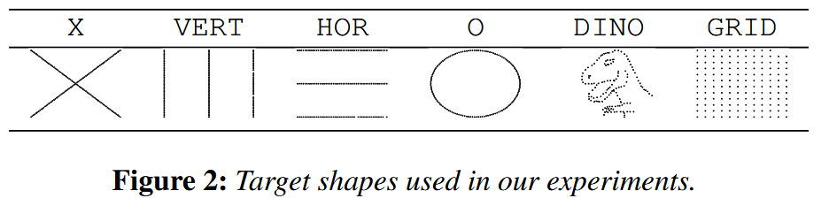
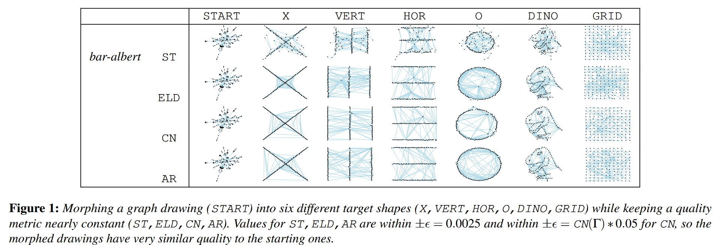
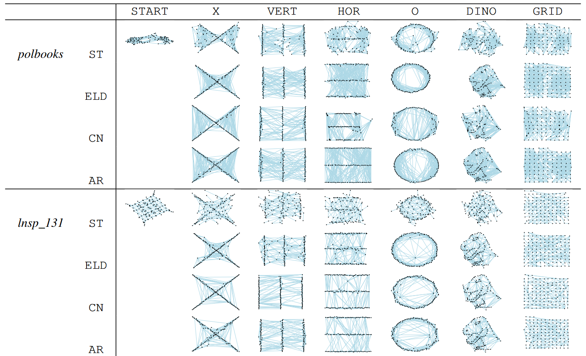
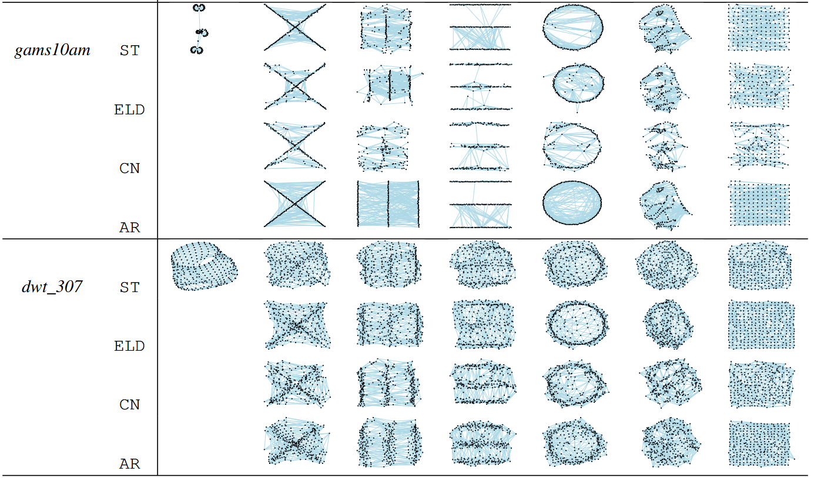
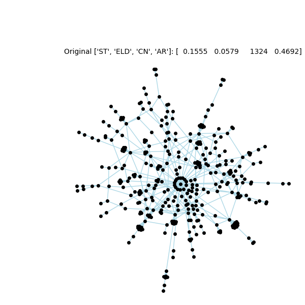

# Same Quality Metric, Different Graph Drawings

# Running instructions

Python version 3.10.4

Install packages with: 'pip install -r requirements.txt'

### Minimal example
With a single git clone (make sure you use git lfs to properly clone the csv files (in /data/) or dowload the csv files manually) you can start spoofing metrics on any target shape and graph.

If you'd like to simply try out the algorithm and reproduce the paper's results, only concern yourself with the given example data in /data/, run **main_mult.py** and subsequently **final_drawings.py**.

1. Before you try to start spoofing the graph drawings, ensure the following are correct.
- Have your edgelist(s) in /data/edgelists/; for the correct format see one of the example graphs in /data/edgelists/
- Either have your starting coordinates in /data/start_coords/ OR run **init_coords.py** to generate coordinates and initial drawings
2. Run **main_mult.py** to morph starting drawings into target shapes
- Adjust **main_mult.py** to reduce or increase the number of graphs/target shapes/metrics.
-  You can also adjust the parameter values such as the starting temperature T, quality metric difference epsilon, number of iterations, max amount of time give to the algorithm
3. Once the algorithm has generated new coordinates close to the target shapes for your input graphs, run **final_drawings.py** to produce .pdf images of your resulting spoofed drawings.

## Explanations other python files
**final_drawings.py**: Script to produce the final .pdf drawings of all your morphed drawings of your graphs in your dataset. Only works if you have the coordinates of your results 
after running main.py in /results/

**init_coords.py**: Script to produce the starting coordinates of your graphs in your dataset using ForceAtlas2, coordinates are put in /data/start_coords/. Also produces .png images of these initial coordinates including
information on the quality metric values of the initial drawings in /results/

**jitterplot_stat_test.py**: Script to produce the jitterplots from the paper and to perform the statistical testing from the results in the paper.

**main_mult.py**: Main script to start morphing existing graph drawings into target shapes. Adjust lines of code in here for different (combinations of) metrics

**metrics.py**: Collection of quality metric functions and similarity functions

**rr_main.py**: Main script to start morphing existing graph drawings into target shapes acquired from a given video. The given video, and the script that extracts the frames is in the /rickroll/ folder. The original .gif was acquired from https://zepsilon.wordpress.com/2016/01/06/animating-the-rick-roll/. This script removes color from each frame, then extracts the lines in each frame and turns them into a set number of points.

**rr_final_drawings.py**: Script to produce the final .pdf drawings of all the morphed drawings produced by the **rr_main.py** script. Only works if you have the coordinates of your results.

**sim_anneal_mult.py**: Script of the main algorithm with the similarity function described in the paper

**target_gen.py**: Collection of functions capable of generating the target shapes described in the paper (for the dinosaur generation make sure you have dino-init.csv in /data/start_coords/)

**target_shapes.py**: Script to produce .pdf images of all the target coordinates (not graph drawings) of your target shapes, currently set number of points is 142

# Deprecated scripts
**main.py**: Script to start morphing existing graph drawings into target shapes, only works for a single metric. Adjust lines of code in here for different metrics

**sim_anneal.py**: Script of the main algorithm with the similarity function described in the paper, only works for a single metric.

**sim_anneal_wasserstein.py**: Script of the main algorithm with the Wasserstein Distance and Sinkhorn Algorithm excluded in the paper

## Example Figures of Spoofed Drawings
For the following six target shapes we spoof 5 graphs ('bar-albert, 'polbooks', 'lnsp_131', 'gams10am', 'dwt_307') on four different quality metrics (ST : Stress, ELD : Edge Length Deviation, CN : number of crossings, AR : Angular Resolution).

## Reproducing a Video
From a reference video, we use each frame as a target shape while keeping a metric the same
The initial drawing of a Barabasi-Albert graph with the following quality metric values:

The target video:

The recreated videos with the metric kept the same

 

 